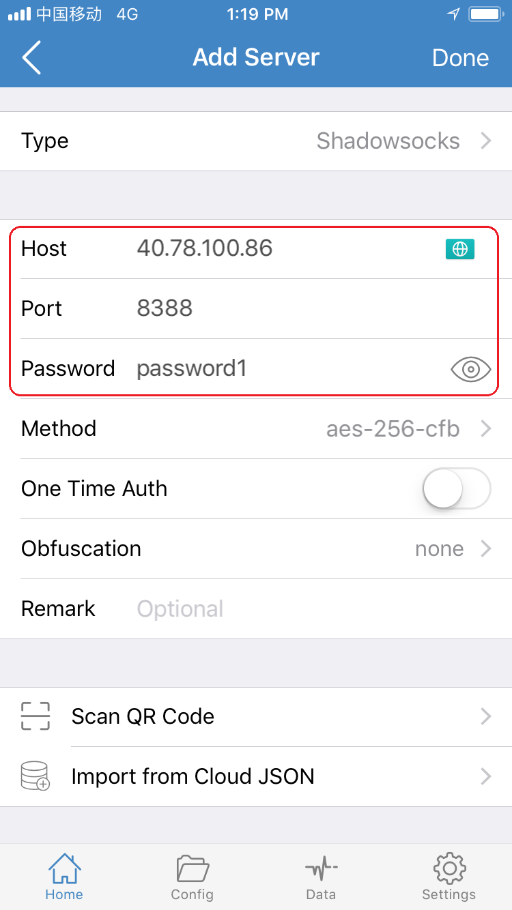
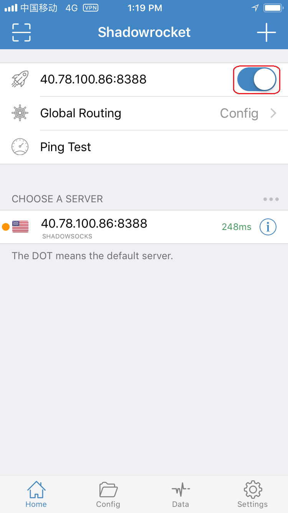
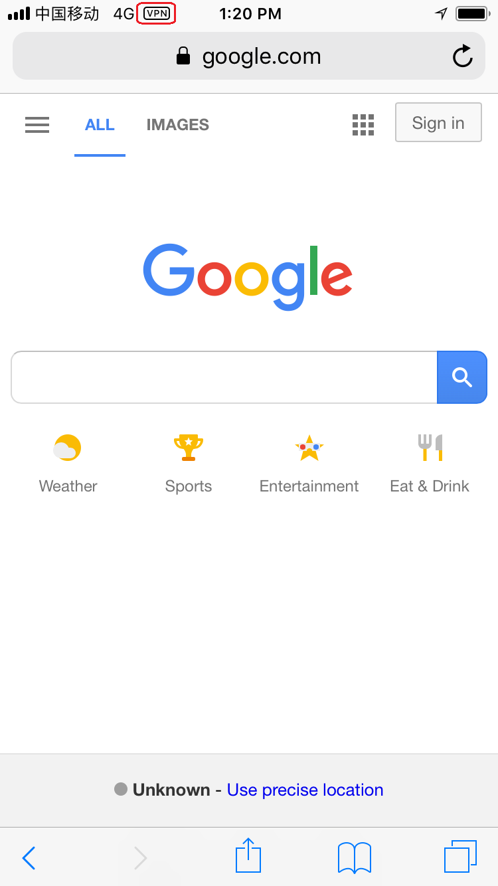

# Run Shadowsocks in Azure Container Instances (ACI)

VPN is very useful in mainland China, and [Shadowsocks](https://shadowsocks.org) is a popular proxy server. Now that [Shadowsocks has docker support](https://hub.docker.com/r/oddrationale/docker-shadowsocks), and we can host docker containers on Azure, it becomes very easy to deploy Shadowsocks on Azure. In this post, I'll show you how to deploy a Shadowsocks server on [Azure Container Instances](https://azure.microsoft.com/services/container-instances/) in **just one command**.

I assume that you already have an Azure subscription at hand and there is at least one [resource group](https://docs.microsoft.com/azure/azure-resource-manager/resource-group-portal") in it. [Create a free one](https://azure.microsoft.com/free/) if you haven't yet.

To run the command to create a running Shadowsocks server, go to [Azure Portal](https://portal.azure.com), click the Cloud Shell icon in the top bar.


In the Cloud Shell that pops up at the bottom, make sure **Bash** is selected since the command is in Azure CLI. Type the below command.

```azurecli
az container create -g shadowsocks --name shadowsocks1 --image oddrationale/docker-shadowsocks --ip-address public --ports 8388 --command-line "/usr/local/bin/ssserver -k password1"
```


In the above command,

* `az container create` indicates Azure to create an Azure Container Instance.
* `-g shadowsocks` specifies the resource group name. My resource group name is shadowsocks, but yours can be different.
* `--name shadowsocks1` specifies the container instance's name. Yours can be different.
* `--image oddrationale/docker-shadowsocks` specifies to use the Docker image [oddrationale/docker-shadowsocks](https://hub.docker.com/r/oddrationale/docker-shadowsocks/) on Docker Hub.
* `--ip-address public` The IP address of the container instance must be public so that you can connect to it from your client phone or desktop.
* `--ports 8388` Opens port 8388 to the public, which is the port where Shadowsocks server works on by default. It is equivalant to `-e 8388 -p 8388:8388` if you use `docker run` command.
* `--command-line "/usr/local/bin/ssserver -k password1"` indicates to run ssserver (Shadowsocks server) when the container starts. `-k password1` specifies the password when you connect to the server. Use your own strong password (don't use simple ones, and avoid special characters like `$`).

Running the above script in Cloud Shell will return a JSON object, which means the creation is successful.

To verify that the Shadowsocks server is running well, navigate to the container group that you created and check its **STATE**. It should be **Running** if everything went smooth. Remember the IP address, which you will use when you connect to the server.


With just one command, we've got a Shadowsocks server running in Azure Container Instance.

Just for completeness, I'll show you how to connect to the server from iOS.

* Install [Shadowrocket](https://itunes.apple.com/us/app/shadowrocket/id932747118) from App Store. When first run, you need to grant permission to the app to write VPN settings. Other Shadowsocks client apps also work.
* Add a server and fill in the **Host**, **Port** and **Password** fields accordingly. Leave other fields as default.
* Toggle the connect button to connect to the Shadowsocks server.
* *Now you can open Google from mainland China!






